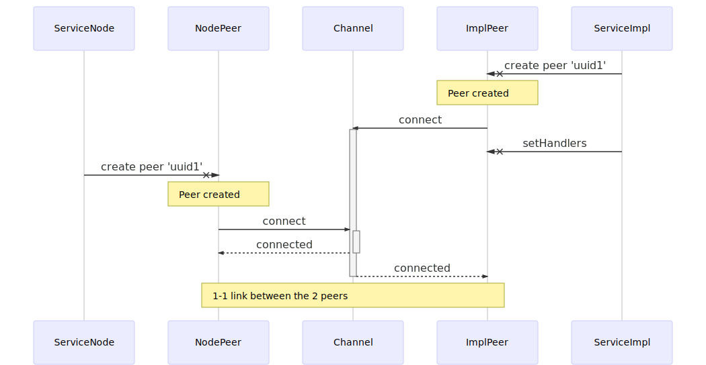
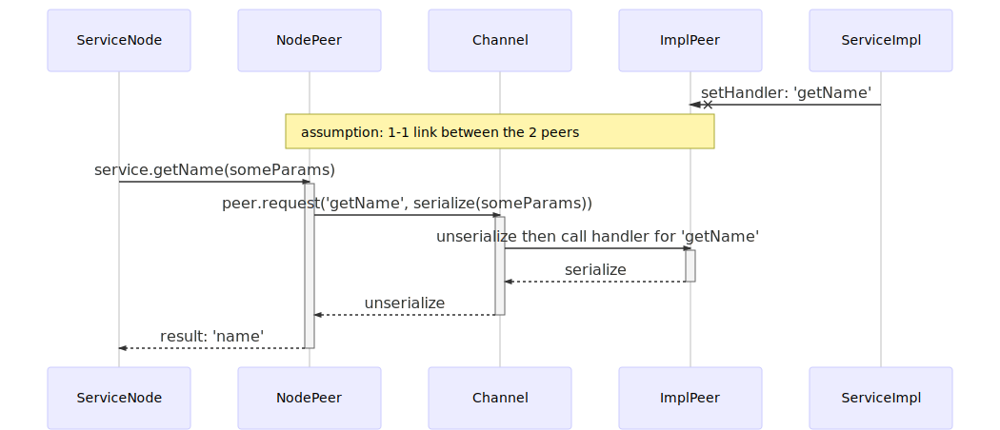

# Services Framework
## What is it?
This is the core of our multi-process architecture.
It allows us to define Services (Typescript classes) that can be called from any process (renderer/main/worker).

## How does it work
First, some vocabulary:
- **Service implementation**: Instance of a service that handle the logic, like any regular class.
  The implementation resides in a **single, known process**. For instance, _MenuService_ resides in _main_ process.
- **Node**: Instance that makes indirect (or direct) calls to interact with its _implementation_
- **Channel**: A _Stream_ whose purpose is to connect 2 different process
- **Peer**: A _Stream_ whose purpose is to connect 2 services instances
- **Global Services**: Those are services that are instanciated only once by process at startup

If something needs to be called from another process, Services are the way to go.
- A simple Service possesses **one** _implementation_, and multiple _Nodes_
- Indirect calls between a _Node_ and its _implementation_ are handled through RPC
- In order to have a unique way to call every methods on Service, whatever the source, each methods of a Service returns a _Promise_
- By default, all requests have a timeout of 2 seconds enforced by [stream-json-rpc](https://github.com/getstation/stream-json-rpc)
  - It can be overidden with `@timeout(ms: number)` decorator. See below for details.

### Cookbook
- [Steps to make a service](COOKBOOK.md#make-a-service-steps)
- [Example with an observer](COOKBOOK.md#example-with-an-observer)

### Example: MenuService
#### Usage: old way vs. current way
##### Enable a MenuItem
###### Old way
```typescript
// Only works in main process 😢
const menuInstance = new BrowserXMenuManager();
// Direct usage of Electron API
menuInstance.getMenuItemById(menuItemId).enabled = true;
```

###### Current way
```typescript
// Works in all processes 🎉
// Implementation process
const menuService = new MenuService('__default__');
// other processes
const menuService = new MenuService.Node('__default__');
// then
menuService.setEnabled({ menuItemId, value: true });
```

##### Listen for MenuItem clicked event
###### Old way
```typescript
// Only works in main process 😢
menuInstance.on('click-item', handler);
```

###### Current way
```typescript
// Works in all processes 🎉
menuService.requestNotifications(observer({
  onClickItem(param) {
    handler(param)
  }
}));
```
NB: `observer` is a helper to convert the given object to an actual Service.

#### Interface
This is the first thing that needs to be created when creating a new Service
in `services/services/<my-new-service>/interface.ts`.
It defines all interfaces that any _Node_ (including the _implementation_) can use.
⚠️ We can't just define TS `interface`s for numerous reasons, we instead need to declare classes with empty methods.
```typescript
import { RPC } from '../../lib/types';
import { ServiceBase } from '../../lib/class';

export type IMenuServiceSetMenuItemBooleanParam = { menuItemId: string, value: boolean };

// Decorator that sets the namespace of the service (to avoid collisions)
@service('menu')
export class MenuService extends ServiceBase implements RPC.Interface<MenuService> {
  // Mark/unmark a MenuItem as `checked`
  // ⚠️ All requests must return a Promise !
  // @ts-ignore
  setChecked(param: IMenuServiceSetMenuItemBooleanParam): Promise<void> {}

  // Enable/disable a MenuItem
  // @ts-ignore
  setEnabled(param: IMenuServiceSetMenuItemBooleanParam): Promise<void> {}

  // Show/hide a MenuItem
  @timeout(3000) // overrides default timeout for `setVisible` request. 0 means no timeout
  // @ts-ignore
  setVisible(param: IMenuServiceSetMenuItemBooleanParam): Promise<void> {}
}
```

#### Implementation
The implementation of a Service resides in a unique process.
```typescript
import { fromEvent } from 'rxjs/observable/fromEvent';
import { BrowserXMenuManager } from '../../../menu/app-menu';
import { RPC } from '../../lib/types';
import { getNode, service, ServiceBase } from '../../lib/class';
import { MenuService, IMenuServiceSetMenuItemBooleanParam } from './interface';
import { app, Menu } from 'electron';

// All Services implementations must extend their interface and implement `RPC.Node<I>`
// `ServiceBase` does all the magic, and `RPC.Interface` ensures proper typing
/**
* @process main
*/
export class MenuServiceImpl extends MenuService implements RPC.Interface<MenuService> {

  protected menuManager: BrowserXMenuManager;

  constructor(uuid?: string) {
    super(uuid);
    // or, if you want to handle a lyfecycle internally
    super(uuid, { ready: false }); // The service is considerer ready when `.ready()` is called.
                                   // In this case, all calls to `.whenReady()` will resolve only when or after `.ready()` has been called once.
    this.menuManager = new BrowserXMenuManager();
  }

  async setChecked({ menuItemId, value }: IMenuServiceSetMenuItemBooleanParam) {
    this.menuManager.menu.getMenuItemById(menuItemId).checked = value;
  }

  async setEnabled({ menuItemId, value }: IMenuServiceSetMenuItemBooleanParam) {
    this.menuManager.menu.getMenuItemById(menuItemId).enabled = value;
  }

  async setVisible({ menuItemId, value }: IMenuServiceSetMenuItemBooleanParam) {
    this.menuManager.menu.getMenuItemById(menuItemId).visible = value;
  }
}
```

#### Register the service
If your service is a Global Service (i.e. only one instance by process), you need to register it.
```diff
// app/services/types.ts
+ import { IMenuService } from '../menu/interface'

export type GlobalServices = {
  // Here you should add your Global Service
+  menu: RPC.Node<IMenuService>,
};
```

##### main
[Update `services` object in `services/main/index.ts`](main/index.ts)

##### renderer
[Update `services` object in `services/renderer/index.ts`](renderer/index.ts)

#### Instantiation
The first parameter of a Service constructor is a unique identifier that allows to automagically map a _Node_ to its _implementation_ when they both have the same id.
```typescript
// In main
new MenuServiceImpl('__default__');

// In renderer
new getNode(MenuService)('__default__');
```

#### Utils
Here is a description of usefull utils and classes that are here to help use Services:
```typescript
// Attach a namespace to a Service class, and register it  (necessary for (de)serialization)
@service(namespace: string, options: ServiceDecoratorOptions)

// Modify default timeout for given request (just above a method in an interface definition)
@timeout(10000)
@timeout(0) // Infinite

// All Services must extend this class
// All services have a `destroy()` method
abstract class ServiceBase

// A Service extending this class is aware of its Peer (mandatory to make remote requests)
abstract class ServicePeer extends ServiceBase

// A Service which have an `unsubscribe` method
class ServiceSubscription extends ServiceBase

// Allows us to instantiate observers without creating a dedicated class for it
observer({...})

// Get the Node version of a Service class
getNode(klass)

// The DEBUG env var will help debugging the framework
DEBUG=services:*
```

#### Architecture overview
How does Nodes communicate with their Implementation


#### Node initialization sequence
How a Node is initialized


#### Node request sequence
How a Node makes a request (once initialized)


#### Destruction sequence
How does a Service destruction is propagated.
Rules:
 - If a _Node_ is destroyed, it destroys also its _Implementation_ only if the _Node_ is a `ServicePeer` (because it implies a 1-1 connection)
   - e.g.: all nodes created through `observer(...)`. Destroying an observer on either side destroys it on the other.
 - If an _Implementation_ is destroyed, all connected _Nodes_ are destroyed
 - If a _Peer_ is destroyed:
   - On the same process: connected _Nodes_ are destroyed
   - On the other process: first the other part of the _Peer_ is destroyed, then connected _Nodes_
 - If a _Channel_ is destroyed:
   - All attached _Peers_ are destroyed
     - All attached _Nodes_ are destroyed
